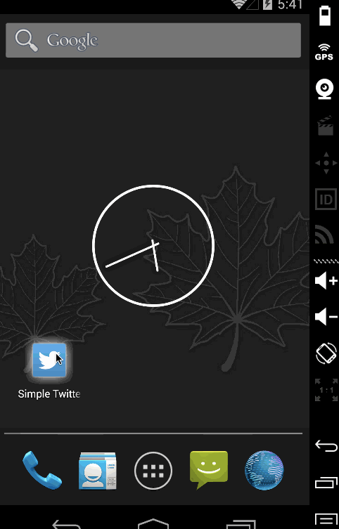

# Simple twitter client

Weekly Assignment Submission

This is a simple Twitter Application for viewing user's timeline and posting tweets using [Twitter's  REST API](https://dev.twitter.com/rest/public).

Time spent: 15 hours spent in total

Completed user stories:

 * [x] Required: User can sign in to Twitter using OAuth login
 * [x] Required: User can view the tweets from their home timeline
        * [x] User should be displayed the username, name, and body for each tweet
        * [x] User should be displayed the relative timestamp for each tweet "8m", "7h"
        * [x] User can view more tweets as they scroll with infinite pagination
        * [x] Optional: Links in tweets are clickable and will launch the web browser (see autolink)
 * [x] Required: User can compose a new tweet
       * [x] User can click a “Compose” icon in the Action Bar on the top right
       * [x] User can then enter a new tweet and post this to twitter
       * [x] User is taken back to home timeline with new tweet visible in timeline
       * [x] Optional: User can see a counter with total number of characters left for tweet
 * [x] Advanced: (Optional) User can refresh tweets timeline by pulling down to refresh (i.e pull-to-refresh)
 * [x] Advanced: Improve the user interface and theme the app to feel "twitter branded"
 * [x] Bonus: Compose activity is replaced with a modal overlay (using Fragment)

Walkthrough of all user stories:

GIF created with [LiceCap](http://www.cockos.com/licecap/).
